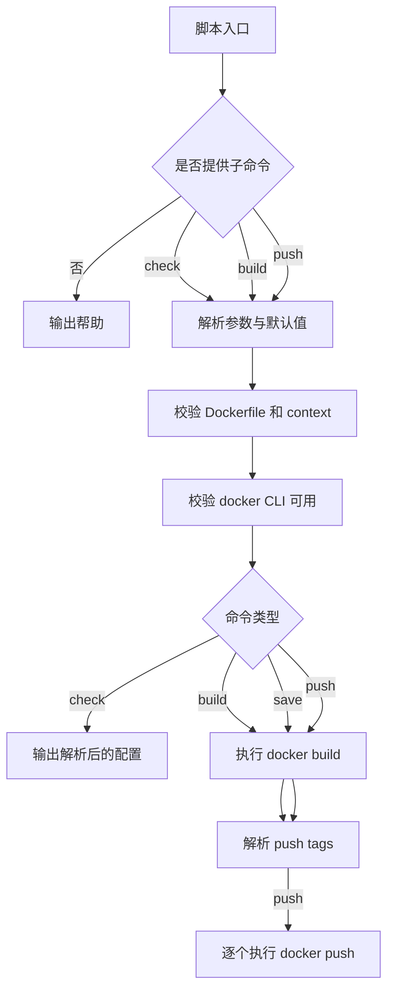

## Docker image 推送脚本说明

### 职责

| 命令 | 职责 | 输入 | 输出 | 依赖 | 关键约束 |
| --- | --- | --- | --- | --- | --- |
| `check` | 校验镜像推送所需配置 | CLI 参数、环境变量、`package.json` | 解析后的镜像配置与校验结果 | Node.js、Docker CLI、`Dockerfile` | 不执行构建或推送 |
| `build` | 本地构建 Docker image | `--image` `--tag` `--extra-tags` `--platform` `--dockerfile` `--context` | `docker build` 执行结果 | Docker CLI | 仅构建，不推送 |
| `save` | 本地构建并导出 Docker image tar 包 | `build` 的全部参数，外加 `--output` | `docker build` 与 `docker save` 执行结果 | Docker CLI | 默认导出到仓库根目录，便于手动上传到远程机器 |
| `push` | 构建并推送 Docker image | 同 `build` | `docker build` 与逐个 `docker push` 执行结果 | Docker CLI、已登录的镜像仓库 | 主 tag 不是 `latest` / `dev` 时，自动连带推送 `latest` |

### 输入解析

| 参数 | 默认值 | 说明 |
| --- | --- | --- |
| `--image` | `docker.io/gaohaha445/weread-challenge` | 目标镜像仓库 |
| `--tag` | `package.json` 中的 `version` | 主 tag |
| `--extra-tags` | 空 | 额外 tag，使用英文逗号分隔 |
| `--platform` | 空 | 透传给 `docker build --platform` |
| `--dockerfile` | `Dockerfile` | 构建使用的 Dockerfile 路径 |
| `--context` | `.` | Docker build context |
| `--output` | `<image-name>-<tag>.tar` | `save` 命令输出的 tar 文件路径，相对路径基于仓库根目录 |

### 流程



### 关键约束

| 约束 | 说明 |
| --- | --- |
| 帮助优先 | 空参数或 `help/-h/--help` 仅输出帮助文本 |
| 默认最小化 | `build` 默认只处理一个主 tag；额外 tag 必须显式传入 `--extra-tags` |
| 版本来源 | 未传 `--tag` 时，主 tag 直接取 `package.json.version` |
| 版本发布补 latest | `push` 时如果主 tag 不是 `latest` 也不是 `dev`，自动把 `latest` 一起构建并推送 |
| `dev` 推送入口 | `npm run docker:image:push:dev` 固定把当前仓库实现推送到 `dev` tag |
| 本地交付入口 | `npm run docker:image:save:amd64` 默认按 `linux/amd64` 构建并导出 tar，适合上传到 x86 Linux 机器 |
| 显式失败 | 参数缺失、未知参数、Docker 不可用、文件不存在时直接报错并退出 |
| 不做隐式多架构 | 脚本不会默认启用多架构发布 |

### 本地打包并上传到 x86 Linux

1. 本地构建并导出 tar：

```bash
npm run docker:image:save:amd64 -- --tag latest
```

2. 如需自定义输出文件名：

```bash
npm run docker:image:save:amd64 -- --tag latest --output dist/weread-challenge-latest.tar
```

3. 上传到远程机器后加载镜像：

```bash
docker load -i weread-challenge-latest.tar
```

4. 加载完成后按本地 tag 运行，例如：

```bash
docker run --rm \
  -e DEFAULT_BOOK_URL=https://weread.qq.com/web/reader/276323e0813ab90a5g0144d7 \
  gaohaha445/weread-challenge:latest
```
